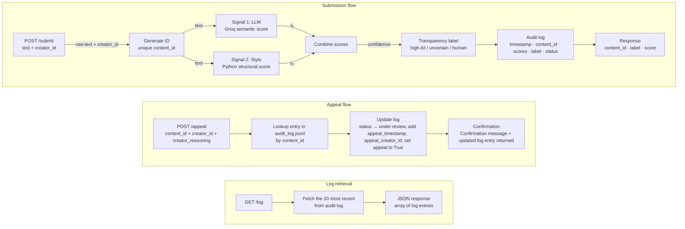

# Project 4 - Provenance Guard

## Architecture Narrative Overview
Submission:
- User submits text content along with their user/creator ID
- A POST request is made to the /submit endpoint of the API, containing the content text and the creator_id
- The submitted JSON is then processed:
    - a unique ID is generated for the particular submission
    - Two independent signal scores are computed
    - These two signal scores are combined into one confidence score
    - An attribution and transparency label are chosen, depending on the confidence score thresholds
    - These new fields are stored in JSON and logged
    - The results are returned from the endpoint

Appeals:
- User makes a POST request to the /appeals API endpoint, containing the creator_id, content_id, and creator_reasoning (as text) for the appeal
- The request is processed:
    - Using the content_id, the log is updated to reflect an appeal currently under review, along with the user's text reasoning
    - The updated JSON line of the log is returned from the endpoint, along with a confirmation message and updated status

Getting Logs
- User makes a GET request to the /log endpoint
- The endpoint returns the 20 most recent log entries

## Architecture Diagram

**Submission Flow:** The user makes a POST request to the /submit endpoint containing the creator_id and text. A unique content_id is created for that submission using UUID (uuid4()). The content text is fed to both signal functions: get_llm_score() from llm_signal.py, and get_stylo_score() from stylo_signal.py. The final confidence score is calculated with compute_confidence from confidence.py, and is mapped to one of three labels. A log entry is made, and the relevant fields from the entry are returned.

**Appeal Flow:** User makes a POST request to the /appeal endpoint with the content_id, creator_id, and creator_reasoning containing the reason for the appeal request. The content_id is used to look up the entry in the logs, and the matching log entry is updated. The updates include setting the "appeal" field to True, adding appeal_timestamp, appeal_creator_id, and appeal_reasoning. If no matching entry is found, a 404 error is returned with a helpful message. The updated status, a confirmation message, and the updated log entry are returned.


## Detection Signals

### Signal 1: LLM Scoring (Inference via Groq API)
**See File:** llm_signal.py
- Base Model: `llama-3.3-70b-versatile`, served via Groq API
- In the system prompt, inform it to predict a AI score from 0.0 to 1.0, with 1.0 indicating high certainty of AI-generated text, and 0.0 indicating high certainty of human-written text.
- In the user prompt, provide the full text submitted by a user.

Below is the system prompt used:
```
You are an AI-detection classifier. Assess whether the text was written by a human or generated by an AI.

Step 1 — briefly note what you observe about each of these:
- Sentence length uniformity (AI tends to be very consistent)
- Formulaic transitions ("Furthermore", "It is important to note")
- Hedging language ("it is worth noting", "one might argue")
- Unpolished markers: typos, run-ons, informal tone, tangential asides (human)
- IMPORTANT: Do not use genre as a signal. Poetry, essays, and notes can all be AI or human.

Step 2 — output your score on the LAST line in exactly this format:
SCORE: 0.00

Scale: 0.0 = very confident human, 1.0 = very confident AI.

Note: You can output any score between 0.0 and 1.0, not just those two numbers.
```

**Output:** A numeric score from 0.0 to 1.0, with 0.0 indicating high confidence of human writing, and 1.0 indicating high confidence of AI-generated text.

**What this Property Captures:** This signal captures the semantic meaning of the text (that is, how the text "sounds" when its read). This captures the difference between more colloquial human writing and more structured and formulaic AI-generated text.

**Why I Chose It:** Using an LLM as a judge is a common method for analyzing written work. Despite being prone to variability, it has a better chance of working on a dynamic range of content submissions, making it more adaptable than fixed textual and statistical analysis methods.

**Signal Blind Spot:** Using an LLM-as-a-judge, despite being a common method, is more stochastic than pure text analysis. Therefore, the LLM might falter to produce a reasonable score/signal, depending on the content of the text and it is formatted. For example, formal academic writing and older works involving poetry might use redundant and/or verbose wording and stylistic choices. Such content might be interpreted as AI generated, despite being written by a human.


### Signal 2: Python Textual Statistics (No Inference)
**See File:** stylo_signal.py
- Two text statistics were combined into one stylistic score
- Statistic #1: Standard Deviation of Word Count Per Sentence
    - Why I Chose It: AI generated content tends to have more uniform sentence lengths, resulting in a lower standard deviation of word count per sentence. Human generated content tends to have more variation in sentences lengths, resulting in a higher standard deviation of word count per sentence.
    - How It Is Calculated: 
        - The raw standard deviation is calculated (raw_stdev)
        - The raw_stdev is normalized to a range of [0.0, 1.0], by taking the minimum of raw_stdev / STDEV_CEILING or 1.0 (this becomes normalized_stdev)
            - STDEV_CEILING is set to 8, since stdevs higher than 8 tend to indicate more human writing
                - This number is like a hyperparameter, and should be adjusted based on the domain (fiction writing, academic, short prose, etc)
        - Since a lower normalized_stdev indicates MORE chance of AI content, flip the score: stdev_score = 1 - normalized_stdev
        - stdev_score: between 0.0 and 1.0, higher means greater chance of AI content
- Statistic #2: Average Word Length
    - Why I Chose It: AI generated content tends to use repetitive vocabulary involving words with more syllables, compared to more colloquial human writing and conversation. A higher average word length would then indicate a greater chance of AI generated text.
    - How It Is Calculated:
        - The raw average word length is calculated (raw_wordlen)
        - raw_wordlen is normalized to a range of [0.0, 1.0], by taking the minimum of raw_wordlen / WORD_LEN_CEILING or 1.0 (wordlen_score)
            - WORD_LEN_CEILING is set to 7.0, since AI content and more formal vocabulary tend to meet or exceed this average word length
                - Just like STDEV_CEILING, WORD_LEN_CEILING is a hyperparameter of sorts that should be changed and tested for domain-specific use cases (ex: formal academia involving longer words on average)
        - wordlen_score: between 0.0 and 1.0, higher means greater chance of AI content

Lastly, both the stdev_score and wordlen_score were combined in a weighted sum to get the overall Signal 2 score:
- **Formula:** final signal 2 score = 0.5 x (stdev_score) + 0.5 x (wordlen_score)

stdev_score and wordlen_score are returned as part of a dictonary from the get_stylo_score() method, and these individual statistics are also logged as part of the .jsonl entry, for debugging purposes.


Initially, the plan was to use Type-Token Ratio (number of unique words divided by total words) as Statistic #2, but testing showed that it produced unreliable results, compared to average word length.

**Output:** A numeric score from 0.0 to 1.0, with 0.0 indicating high stylistic matches to expected human writing, and 1.0 indicating high stylistics matches to expected AI-generated text

**What this Property Captures:** This signal captures the **structure** of the text. Less variation in the listed statistics might indicate AI-generated context, while more variation in the stats lean towards human writing.

**Signal Blind Spot:** Different styles of human writing can easily be misclassified as AI, especially more formal academic writing and older works. Such writing pieces can contain more uniform sentences or heavy use of domain-specific vocabulary, even if it was entirely written by a human.

## Confidence Scoring

### Combining Two Signals Into One Score
A weighted sum of the normalized scores from Signal 1 (LLM) and Signal 2 (Text Analysis) are used to calculate the single final confidence score. Since Signal 1 uses LLM inference, it takes a more holistic approach to the content given. Therefore, more weightage is given to Signal 1 in the final calculation.

The weightage (currently a 70-30 split between Signals 1 and 2) is another set of parameters that can be changed as needed for specific use cases. Doing a 50-50 split seemed to give too much weightage to textual analysis, which is a method that does not consider the actual wording or content, just statistics from the text. A field named "signal_gap" is logged, which is the absolute difference of the signal scores. This allows someone to check the system for certain submissions, to see if there is heavy disagreement between the two signals.

**Formula:** $\text{Confidence Score} = 0.7 \times (\text{Signal 1 Output}) + 0.3 \times (\text{Signal 2 Output})$

You can run signals/confidence.py to see confidence scores for different pairings of Signal 1 and Signal 2. This weighted sum formula ensures that both signals are considered, with the stylo_score being weighted less to prevent over-influencing the final confidence score.

### Mapping Confidence Score to Attribution and Transparency Label
Thresholds are set conservatively to minimize false positives (human work 
misclassified as AI), since this error is more harmful to creators than 
a false negative.

| Score range   | Label            |
|---------------|------------------|
| 0.00 – 0.39   | Likely human     |
| 0.40 – 0.69   | Uncertain        |
| 0.70 – 1.00   | Likely AI        |

Through testing, the confidence scores did not cluster too much within one score range, ensuring that all labels were reachable.

### Two Example Submissions With Different Scores

#### Example 1 (AI - Written by Gemini when prompted "Write about AI today.")
Content Text:
```
Artificial Intelligence today is experiencing a profound shift. The initial era of sheer novelty—where the world gasped at chatbots writing poems and generating quirky images—has matured. Today, AI is transitioning from a reactive, text-in-text-out tool into an active, autonomous ecosystem defined by agency, efficiency, and specialization.
```

JSON Input to /submit Endpoint:
```
{"text": "Artificial Intelligence today is experiencing a profound shift. The initial era of sheer novelty—where the world gasped at chatbots writing poems and generating quirky images—has matured. Today, AI is transitioning from a reactive, text-in-text-out tool into an active, autonomous ecosystem defined by agency, efficiency, and specialization.", "creator_id": "gemini-1"}
```
/submit Endpoint Output:
```
{
    "attribution": "likely_ai",
    "confidence": 0.7434,
    "content_id": "7aca19fd-ce6d-4aa5-8da3-dd44d8950c1c",
    "label": "This submission likely contains AI-generated content, or was modified and edited using AI.",
    "llm_score": 0.8,
    "signal_gap": 0.1886,
    "stylo_score": 0.6114
}
```

Corresponding Log Entry:
```
{"content_id": "7aca19fd-ce6d-4aa5-8da3-dd44d8950c1c", "creator_id": "gemini-1", "attribution": "likely_ai", "confidence": 0.7434, "llm_score": 0.8, "stylo_score": 0.6114, "stdev_score": 0.3438, "wordlen_score": 0.8789, "signal_gap": 0.1886, "label": "This submission likely contains AI-generated content, or was modified and edited using AI.", "status": "uploaded", "appeal": false, "timestamp": "2026-06-30T17:36:57.863741+00:00"}
```

The llm_score is 0.8, and the stylo_score is 0.6114, pushing the final confidence score to 0.7434, high enough to qualify for the "likely_ai" attribution. Notice that the wordlen_score, stdev_score, and signal_gap are included for potential debugging purposes, or for understanding how tweaks to the system change its effectiveness.

#### Example 2 (Human - Excerpt From the First Chapter of *The Great Gatsby* by F. Scott Fitzgerald)
Content Text (Source: https://gutenberg.net.au/ebooks02/0200041h.html):
```
And, after boasting this way of my tolerance, I come to the admission that it has a limit. Conduct may be founded on the hard rock or the wet marshes but after a certain point I don't care what it's founded on. When I came back from the East last autumn I felt that I wanted the world to be in uniform and at a sort of moral attention forever; I wanted no more riotous excursions with privileged glimpses into the human heart. Only Gatsby, the man who gives his name to this book, was exempt from my reaction—Gatsby who represented everything for which I have an unaffected scorn. If personality is an unbroken series of successful gestures, then there was something gorgeous about him, some heightened sensitivity to the promises of life, as if he were related to one of those intricate machines that register earthquakes ten thousand miles away.
```

JSON Input to /submit Endpoint:
```
{
    "text": "And, after boasting this way of my tolerance, I come to the admission that it has a limit. Conduct may be founded on the hard rock or the wet marshes but after a certain point I don't care what it's founded on. When I came back from the East last autumn I felt that I wanted the world to be in uniform and at a sort of moral attention forever; I wanted no more riotous excursions with privileged glimpses into the human heart. Only Gatsby, the man who gives his name to this book, was exempt from my reaction—Gatsby who represented everything for which I have an unaffected scorn. If personality is an unbroken series of successful gestures, then there was something gorgeous about him, some heightened sensitivity to the promises of life, as if he were related to one of those intricate machines that register earthquakes ten thousand miles away.",
    "creator_id": "the-great-gatsby-1"
}
```
/submit Endpoint Output:
```
{
    "attribution": "likely_human",
    "confidence": 0.1666,
    "content_id": "3e5350d5-252c-4526-8171-c40e66fd9db1",
    "label": "This submission is likely originally written by a human, without the use of AI to edit or generate content.",
    "llm_score": 0.1,
    "signal_gap": 0.2221,
    "stylo_score": 0.3221
}
```

Corresponding Log Entry:
```
{"content_id": "3e5350d5-252c-4526-8171-c40e66fd9db1", "creator_id": "the-great-gatsby-1", "attribution": "likely_human", "confidence": 0.1666, "llm_score": 0.1, "stylo_score": 0.3221, "stdev_score": 0.0, "wordlen_score": 0.6443, "signal_gap": 0.2221, "label": "This submission is likely originally written by a human, without the use of AI to edit or generate content.", "status": "uploaded", "appeal": false, "timestamp": "2026-06-30T17:48:11.330788+00:00"}
```

In this example, the confidence score is 0.1666, with the llm_score at 0.1 and the stylo_score at 0.3221. This falls into the likely_human attribution. Since the content comes from an older book that uses longer words and more archaic vocabulary, the stylo_score is higher than the llm_score. Combining the two signals pushes the confidence score into the likely_human category, which is the expected category.

## Typed Transparency Labels
Below are the exact texts that are displayed for each label.

**Likely AI**
```
This submission likely contains AI-generated content, or was modified and edited using AI. 
```

**High Confidence Human**
```
This submission is likely originally written by a human, without the use of AI to edit or generate content.
```

**Uncertain**
```
This submission might contain the use of AI edited content or refinement. Any use of AI for this submission cannot be confidently asserted or disproven.
```

These transparency labels communicate to an end user how likely a content is AI or not, without delving into technical details such as scoring. This ensures that the labels are understandable and accessible to all users of the content platform.

## Example API Usage and Output
The following API calls were done using the Postman lightweight API client. Curl commands and other ways of making API calls will work as well. I found it helpful to use Postman to avoid having to format text at the command line.


### Submitting Content with /submit Endpoint
JSON Body with POST request to localhost:5000/submit:
```
{
    "text": "The race’s splendor lifts her lip, exposes\nAmid her scarlet smile her little teeth;\nThe years are sand the wind plays with; beneath\nThe prisoned music of her deathless roses.\n\nWithin frostbitten rock she’s fixed and glassed;\nNow man may look upon her without fear.\nBut her contemptuous eyes back through him stare\nAnd shear his fatuous sheep when he has passed.\nLilith she is dead and safely tombed\nAnd man may plant and prune with naught to bruit\nHie heired and ancient lot to which he’s doomed,\nFor quiet drowse the flocks when wolf is mute—\nAy, Lilith she is dead, and she is wombed,\nAnd break his vine, and slowly eats the fruit.",
    "creator_id": "william-faulkner-the-poet"
}
```
Text Source: *The Race’s Splendor* Poem by William Faulkner (https://newrepublic.com/article/95918/four-poems-william-faulkner)

/submit Endpoint Output:
```
{
    "attribution": "uncertain",
    "confidence": 0.5134,
    "content_id": "29300ae5-02c7-4dab-8b37-ca095a15dad9",
    "label": "This submission might contain the use of AI edited content or refinement. Any use of AI for this submission cannot be confidently asserted or disproven.",
    "llm_score": 0.6,
    "signal_gap": 0.2888,
    "stylo_score": 0.3112
}
```

Note: This poem, despite being human-written, is labeled as "uncertain", likely due to the use of archaic wording and the content itself being a much older authored work.

### Making an Appeal with the /appeal Endpoint
Using the submission example from above, let us make an appeal for it.

JSON Body with POST request to localhost:5000/appeal:
```
{
    "creator_id":"william-faulkner-the-poet",
    "content_id":"29300ae5-02c7-4dab-8b37-ca095a15dad9",
    "creator_reasoning":"I wrote this poem myself. The non-standard vocabulary and stylistic choices reflect my own writing style."
}
```

Notice that the creator_id is also required. This is done in the case that creators want to report the submissions of others as plagiarism or stolen credit, if the creator who made the submission is not the one making the appeal.

/appeal Endpoint Output:
```
{
    "appeal_timestamp": "2026-06-30T18:07:15.160027+00:00",
    "content_id": "29300ae5-02c7-4dab-8b37-ca095a15dad9",
    "message": "Your appeal has been received and is under review.",
    "status": "under_review",
    "updated_entry": {
        "appeal": true,
        "appeal_creator_id": "william-faulkner-the-poet",
        "appeal_reasoning": "I wrote this poem myself. The non-standard vocabulary and stylistic choices reflect my own writing style.",
        "appeal_timestamp": "2026-06-30T18:07:15.160027+00:00",
        "attribution": "uncertain",
        "confidence": 0.5134,
        "content_id": "29300ae5-02c7-4dab-8b37-ca095a15dad9",
        "creator_id": "william-faulkner-the-poet",
        "label": "This submission might contain the use of AI edited content or refinement. Any use of AI for this submission cannot be confidently asserted or disproven.",
        "llm_score": 0.6,
        "signal_gap": 0.2888,
        "status": "under_review",
        "stdev_score": 0.0,
        "stylo_score": 0.3112,
        "timestamp": "2026-06-30T18:02:46.403640+00:00",
        "wordlen_score": 0.6224
    }
}
```

### Getting the Most Recent Log Entries with the /log Endpoint
Make a GET request to localhost:5000/log.


/log Endpoint Output:
```
{
    "entries": [
        {
            "appeal": true,
            "appeal_creator_id": "test-user-1",
            "appeal_reasoning": "I wrote this myself and it reflects my own views. The language is formal since it is part fo a case study I did on AI impacting different industries.",
            "appeal_timestamp": "2026-06-30T04:13:56.710716+00:00",
            "attribution": "likely_ai",
            "confidence": 0.71,
            "content_id": "8235acb2-8e1e-44eb-b15e-7080ad177ae3",
            "creator_id": "test-user-1",
            "label": "This submission likely contains AI-generated content, or was modified and edited using AI.",
            "llm_score": 0.8,
            "signal_gap": 0.3,
            "status": "under_review",
            "stdev_score": 0.5,
            "stylo_score": 0.5,
            "timestamp": "2026-06-30T03:45:06.157138+00:00",
            "wordlen_score": 0.5
        },
        {
            "appeal": false,
            "attribution": "likely_ai",
            "confidence": 0.7434,
            "content_id": "7aca19fd-ce6d-4aa5-8da3-dd44d8950c1c",
            "creator_id": "gemini-1",
            "label": "This submission likely contains AI-generated content, or was modified and edited using AI.",
            "llm_score": 0.8,
            "signal_gap": 0.1886,
            "status": "uploaded",
            "stdev_score": 0.3438,
            "stylo_score": 0.6114,
            "timestamp": "2026-06-30T17:36:57.863741+00:00",
            "wordlen_score": 0.8789
        },
        {
            "appeal": false,
            "attribution": "likely_human",
            "confidence": 0.1666,
            "content_id": "3e5350d5-252c-4526-8171-c40e66fd9db1",
            "creator_id": "the-great-gatsby-1",
            "label": "This submission is likely originally written by a human, without the use of AI to edit or generate content.",
            "llm_score": 0.1,
            "signal_gap": 0.2221,
            "status": "uploaded",
            "stdev_score": 0.0,
            "stylo_score": 0.3221,
            "timestamp": "2026-06-30T17:48:11.330788+00:00",
            "wordlen_score": 0.6443
        },
        {
            "appeal": true,
            "appeal_creator_id": "william-faulkner-the-poet",
            "appeal_reasoning": "I wrote this poem myself. The non-standard vocabulary and stylistic choices reflect my own writing style.",
            "appeal_timestamp": "2026-06-30T18:07:15.160027+00:00",
            "attribution": "uncertain",
            "confidence": 0.5134,
            "content_id": "29300ae5-02c7-4dab-8b37-ca095a15dad9",
            "creator_id": "william-faulkner-the-poet",
            "label": "This submission might contain the use of AI edited content or refinement. Any use of AI for this submission cannot be confidently asserted or disproven.",
            "llm_score": 0.6,
            "signal_gap": 0.2888,
            "status": "under_review",
            "stdev_score": 0.0,
            "stylo_score": 0.3112,
            "timestamp": "2026-06-30T18:02:46.403640+00:00",
            "wordlen_score": 0.6224
        }
    ]
}
```

## Rate Limiting
**Rate:** 
I chose a rate limit of 10 per minute, and 500 per day per IP.

**Reasoning:** 
A legitimate creator submitting their own work is unlikely to need more than a few submissions per minute. 10/min prevents automated flooding while giving ample headroom for real use. However, the daily limit is higher at 500 per day, since social media platforms often have automated bots or news channels providing live updates, which will require a decent amount of daily messages.

For example, take the World Cup as an example, where people might post various live match updates.

The key is to limit the frequency (10 per minute) while still allowing ample content to be posted daily.


## Rate Limiting Test Output (12 Rapid Requests)
```
$ for i in $(seq 1 12); do curl -s -o /dev/null -w "%{http_code}\n" -X POST http://localhost:5000/submit -H "Content-Type: application/json" -d '{"text": "test", "creator_id": "ratelimit-test"}'; done
200
200
200
200
200
200
200
200
200
200
429
429
```

## Known Limitations
One specific type of content my system would likely get wrong is formal academic writing and older authored works. My Signal 2 (stylo_score) and to a lesser degree Signal 1 (llm_score) both find longer words and more verbose writing as indications of AI generated content. Most of the times, human writing is expected to be a lot more varied, colloquial, and informal. These assumptions then place formal, structured writing and older writing at risk of being classified as likely_ai, even if they are entirely written by a human.

For example, academic papers and findings that use repetitive sentence lengths and domain-specific vocabulary will score high in the stylo_score, and also in the llm_score.

A potential but much more involved fix might be to have a vetted database or archive of older works and human-written submissions to check against (ex: checking a submitted paper excerpt against a database of publications to verify its authenticity).

## Spec Reflection
**How the Spec Helped:** Drafting my individual signals and the architecture narrative + diagram really helped to understand how all the moving parts came together. Using the architecture diagram, I was able to develop and test components individually, before connecting them all together (ex: combining both signals, wiring up endpoints). Establishing written labels and confidence thresholds before implementation gave me a valid way to test AI generated functions, rather than making up thresholds on the spot.

**How I Diverged From the Spec:** My final implementation diverged greatly from the original Signal 2 plan in my spec. For my second statistic, instead of average word length, I was going to use Type-Token Ratio (number of unique words divided by total words), since AI tends to reuse words. The problem I faced during testing was that the length of the submission itself played a big role in computing the Type-Token Ratio, so this statistic proved to be ineffective. 

I then switched out Type-Token Ratio for average word length, which proved to be a better marker of gauging AI vs human writing.


## AI Usage 

### Instance 1
**What I Asked the AI:** I gave Claude my Architecture Diagram and Signal 1 section, and asked it to implement the function(s) for the Signal 1 scors (llm_score). 

**What It Produced:** It produced the contents of signals/llm_signal.py.

**What I Changed:** After some testing, I modified the system prompt to encourage the LLM to think about different textual and stylistic markers, and to reason through them before providing a final score.

### Instance 2
**What I Asked the AI:** I gave Claude my Architecture Diagram and the Signal 2 section, and asked it to implement the function for the Signal 2 score (stylo_score) and any other helper functions such as counting words, calculating sentence length, etc.

**What It Produced:** It produced the contents of signals/stylo_signal.py, with the main function being get_stylo_score().

**What I Changed:** After testing, I changed the second statistic from Type-Token Ratio to average word length. I also updated STDEV_CEILING and WORD_LEN_CEILING for better score normalization.