## Architecture Narrative
Submission:
- User submits text content along with their user/creator ID
- A POST request is made to the /submit endpoint of the API, containing the content text and the creator_id
- The submitted JSON is then processed:
    - a unique ID is generated for the particular submission
    - Two independent signal scores are computed
    - These two signal scores are combined into one confidence score
    - An attribution and transparency label are chosen, depending on the confidence score thresholds
    - These new fields are stored in JSON and logged
    - The results are returned from the endpoint

Appeals:
- User makes a POST request to the /appeals API endpoint, containing the creator_id, content_id, and creator_reasoning (as text) for the appeal
- The request is processed:
    - Using the content_id, the log is updated to reflect an appeal currently under review, along with the user's text reasoning
    - The updated JSON line of the log is returned from the endpoint, along with a confirmation message and updated status

Getting Logs
- User makes a GET request to the /log endpoint
- The endpoint returns the 20 most recent log entries

## Two Detection Signals

### Signal 1: LLM Scoring (Inference via Groq API)
- Base Model: `llama-3.3-70b-versatile`, served via Groq API
- In the system prompt, inform it to predict a AI score from 0.0 to 1.0, with 1.0 indicating high certainty of AI-generated text, and 0.0 indicating high certainty of human-written text.
- In the user prompt, provide the full text submitted by a user

**Output:** A numeric score from 0.0 to 1.0, with 0.0 indicating high confidence of human writing, and 1.0 indicating high confidence of AI-generated text

**How this Property Differs:** This signal captures the semantic meaning of the text (that is, how the text "sounds" when its read). This captures the difference between more colloquial human writing and more structured and formulaic AI-generated text.

**Signal Blind Spot:** Using an LLM-as-a-judge, despite being a common method, is more stochastic than pure text analysis. Therefore, the LLM might falter to produce a reasonable score/signal, depending on the content of the text and it is formatted.


### Signal 2: Python Textual Statistics (No Inference)
- The plan is to combine multiple statistics into a score ranging from [0.0, 1.0]
- Two relevant statistics are:
    - Standard deviation of sentence lengths
        - AI tends to produce more uniform sentence lengths
        - A lower standard deviation might include a higher chance of AI generated content
    - Type-Token Ratio (number of unique words divided by total words)
        - AI tends to to reuse vocabulary, which a lower ratio might indicate
        - Human writing tends to be more varied in word choice, which corresponds to a higher ratio
- This signal will do a weighted sum of both statistics, keeping the final score from 0.0 to 1.0
    - A higher score indicates greater likelihood of AI, so the stats need to be normalized and inverted
    - normalized_stdev = min(raw_stdev / CEILING, 1.0), where CEILING might be 15 words
    - stdev_score = 1.0 - normalized_stdev
        - Lower stdev maps to  higher stdev_score
    - ttr_score = 1.0 - TTR (Type-Token Ratio)
        - lower vocab diversity maps to higher ttr_score
    - **Formula:** final signal score = 0.5 x (stdev_score) + 0.5 x (ttr_score)


**Output:** A numeric score from 0.0 to 1.0, with 0.0 indicating high stylistic matches to expected human writing, and 1.0 indicating high stylistics matches to expected AI-generated text

**How this Property Differs:** This signal captures the **structure** of the text. Less variation in the listed statistics might indicate AI-generated context, while more variation in the stats lean towards human writing.


**Signal Blind Spot:** Different styles of human writing can easily be misclassified as AI, especially more formal academic writing and older works. Such writing pieces can contain more uniform sentences or heavy use of domain-specific vocabulary, even if it was entirely written by a human.

## Combining Both Signals Into a Single Confidence Score
A weighted sum of the normalized scores from Signal 1 (LLM) and Signal 2 (Text Analysis) will be used to calculate the single confidence score. Since Signal 1 uses LLM inference, it takes a more holistic approach to the content given. Therefore, more weightage will be given to Signal 1 in the final calculation.

**Formula:** $\text{Confidence Score} = 0.7 \times (\text{Signal 1 Output}) + 0.3 \times (\text{Signal 2 Output})$

## Mapping Confidence Score to Transparency Label

Thresholds are set conservatively to minimize false positives (human work 
misclassified as AI), since this error is more harmful to creators than 
a false negative.

| Score range   | Label            |
|---------------|------------------|
| 0.00 – 0.39   | Likely human     |
| 0.40 – 0.69   | Uncertain        |
| 0.70 – 1.00   | Likely AI        |

These thresholds are initial estimates, to be validated and adjusted during 
Milestone 4 testing using at least 4 test inputs spanning the confidence range. 
If testing shows scores clustering (e.g. everything lands between 0.5–0.8), 
thresholds will be recalibrated to ensure all three labels are reachable.


## Transparency Label Design

Below are the exact texts that will be displayed for each label.

**Likely AI**
```
This submission likely contains AI-generated content, or was modified and edited using AI. 
```

**High Confidence Human**
```
This submission is likely originally written by a human, without the use of AI to edit or generate content.
```

**Uncertain**
```
This submission might contain the use of AI edited content or refinement. Any use of AI for this submission cannot be confidently asserted or disproven.
```

## Appeals Workflow
**Who Can Submit Appeals:** Any creator that has a submission flagged as "Likely AI" or "Uncertain" can submit an appeal, as long as they can provide reasoning for their appeal.

**Information To Provide:** In the case that a creator wants to submit an appeal, the creator must provide a `creator_id`, the `content_id` unique to the submitted text in question, and some text `reasoning` explaining why an appeal should be considered. Even if a given creator has only one submission, a `content_id` must be included in the appeal.

**What the System Does After Receiving an Appeal:** The JSON line corresponding to the `content_id` is updated, changing the appeal flag to `True`, and appending the `reasoning` text as a field. The date of the appeal submission is added, perhaps as a field such as `appeal_submission_date`. Then, a confirmation of the appeal being received is returned by the endpoint, containing the updated log entry.

A human reviewer would then be able to see the original submission and its metadata, along with the newly added appeal submission date, its reasoning, and whether the appeal flag is set to True or not.

## Anticipated Edge Cases

Some instances where the system might perform poorly:
- Academic work and simple writing that contains more structured, complete sentences and the repeated use of a subset of vocabulary. Such writing, also it might be human, could potentially be flagged as AI. The downside to this is that academic submissions and formal letters or statements might be flagged as AI, which erodes trust in the platform/system.
- AI generated content prompted to follow a specific style. For example, a standard LLM response is easier to catch than an LLM instructed to mimic human writing, or even given examples of human writing styles to mimic. Such content will likely not be flagged as AI for certain.

## Architecture Diagram

**Submission Flow:** User makes a POST request to the relevant endpoint, and then a unique content_id is created, the content text is fed to both signals, a final confidence score is calculated and mapped to one of three labels, a log entry is made, and the resulting entry is returned.

**Appeal Flow:** User makes a POST request to the relevant endpoint, the content_id is used to look up the entry, and the log is updated as per the above "Appeals Workflow" section, with the updated log entry returned as a confirmation of receiving the appeal request.


**Diagram:**

```mermaid
flowchart TD
    subgraph submission["Submission flow"]
        A["POST /submit\ntext + creator_id"] -->|raw text| B["Generate ID\nunique content_id"]
        B -->|text| C["Signal 1: LLM\nGroq semantic score"]
        B -->|text| D["Signal 2: Stylo\nPython structural score"]
        C -->|s₁| E["Combine scores"]
        D -->|s₂| E
        E -->|confidence| F["Transparency label\nhigh-AI / uncertain / human"]
        F --> G["Audit log\ntimestamp · content_id · scores · label · status"]
        G --> H["Response\ncontent_id · label · score"]
    end

    subgraph appeal["Appeal flow"]
        I["POST /appeal\ncontent_id + reasoning"] --> J["Lookup entry\nby content_id"]
        J --> K["Update log\nstatus → under review"]
        K --> L["Confirmation"]
    end

    subgraph logs["Log retrieval"]
        M["GET /log"] --> N["Fetch recent N\nfrom audit log"]
        N --> O["JSON response\narray of log entries"]
    end
```


## AI Tool Plan

### M3 (submission endpoint + first signal)

**Spec Sections to Provide:** The Detection Signals Section and the Architecture Diagram.

**What is Requested to Generate:** I will ask Claude to generate the Flask app skeleton and the Signal 1 function.

**How Output is Verified:** Test various pieces of text (some original, some AI-generated) to see if the Signal 1 function output is consistent, that is, AI generated text scores higher than original text.

### M4 (second signal + confidence scoring)

**Spec Sections to Provide:** The Detection Signals section, the section on combining both signals, and the Architecture diagram.

**What is Requested to Generate:** I will ask Claude to generate the Signal 2 function and the function/logic to combine the two signals.

**How Output is Verified:** I will check the functions by ensuring that AI text consistently scores higher than human text, and that the final score is between 0.0 and 1.0.

### M5 (production layer)

**Spec Sections to Provide:** The Transparency Label Design section, Appeals Workflow, and the Architecture Diagram.

**What is Requested to Generate:** I will ask Claude to generate functions for the label mapping/generation, logging, and the function for the /appeal endpoint.

**How Output is Verified:** I will try different inputs of human text and AI-generated text of different degrees, to ensure that all labels are reachable, and that the logging and appeal works as intended.